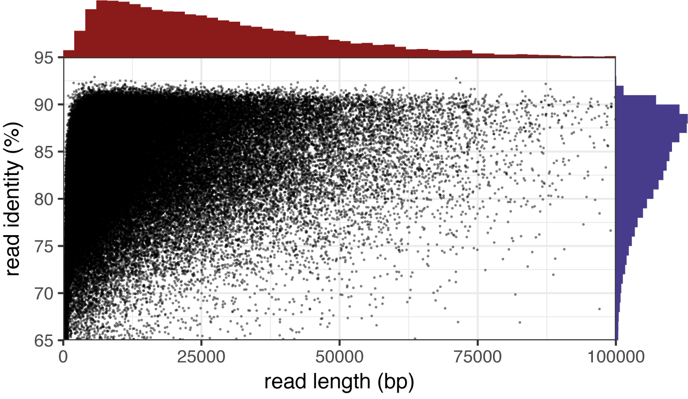
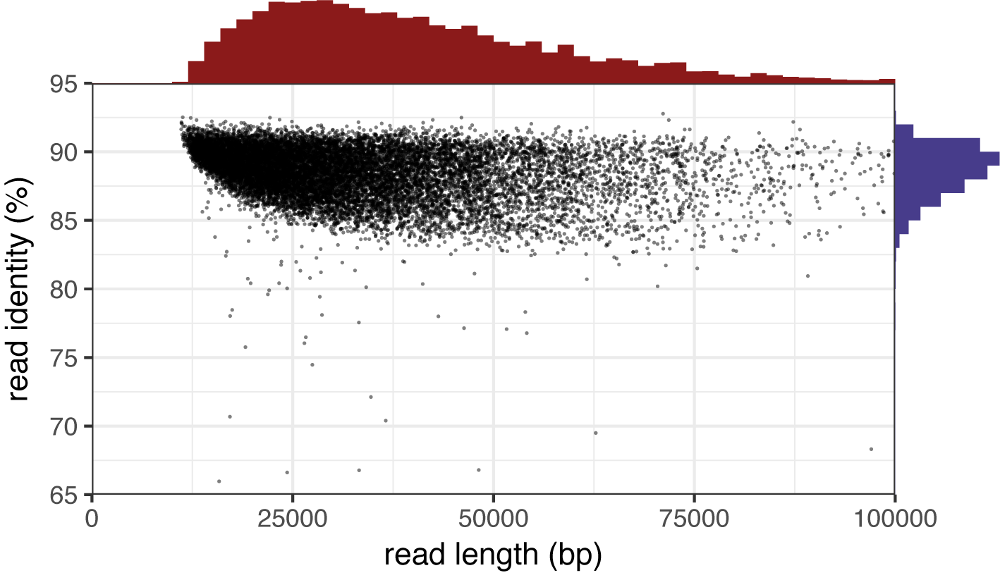
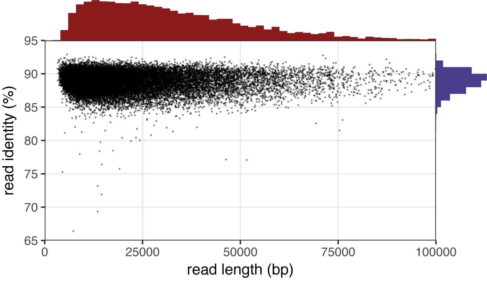
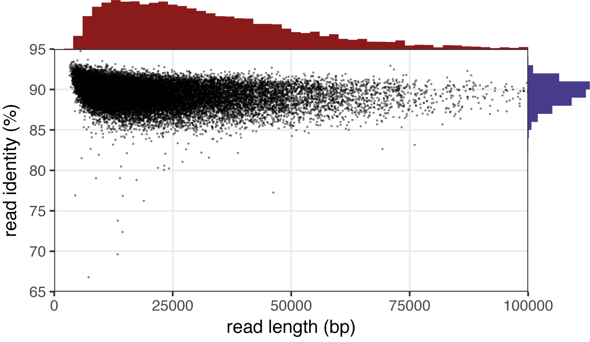
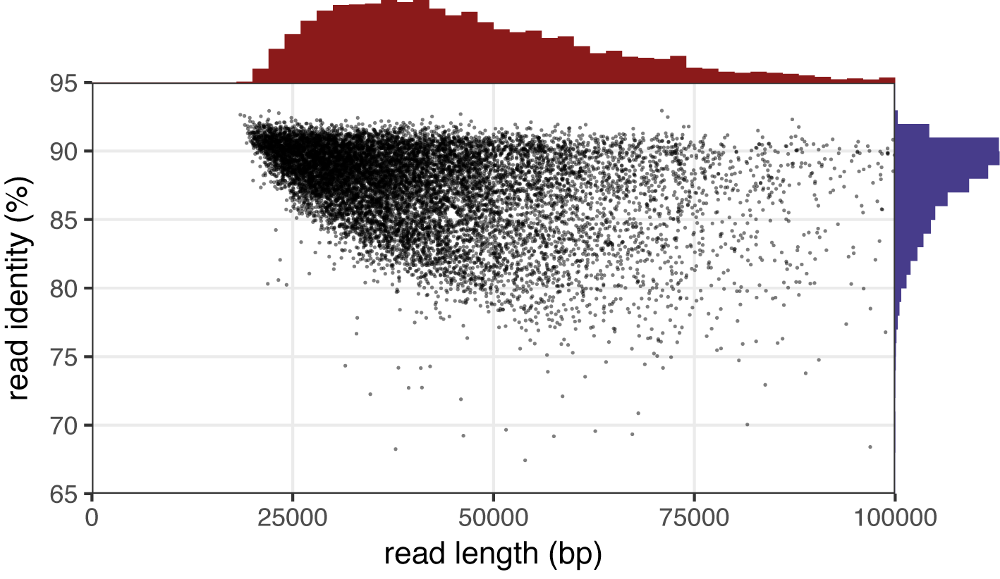
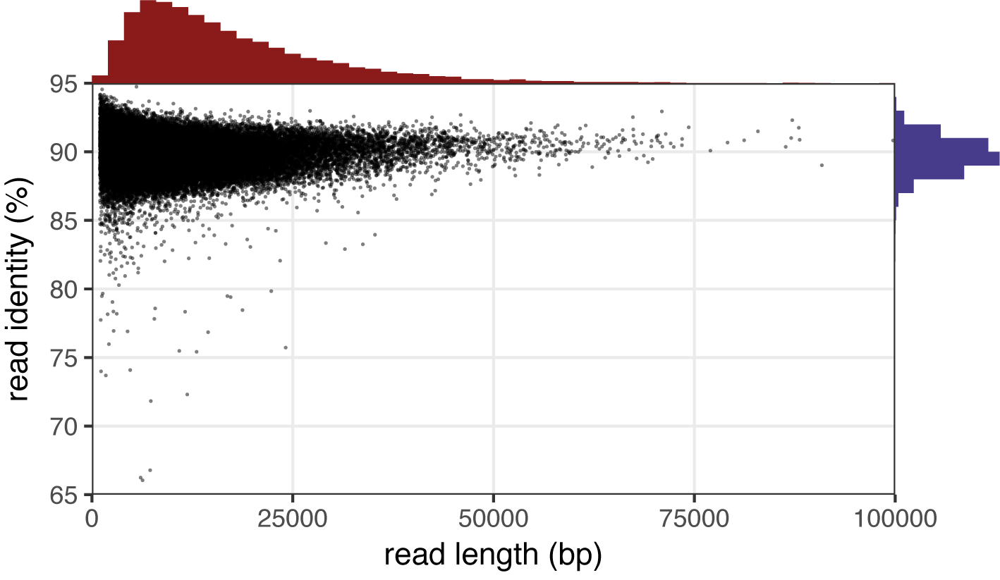

<p align="center"></p>

Filtlong is a tool for filtering long reads. It can take a set of long reads and produce a smaller, better subset. It uses both read length (longer is better) and read identity (higher is better) when choosing which reads to output.


## Table of contents

* [Requirements](#requirements)
* [Installation](#installation)
* [Example commands (quick)](#example-commands-quick)
* [Example commands (detailed)](#example-commands-detailed)
* [Full usage](#full-usage)
* [Method](#method)
* [Read scoring](#read-scoring)
* [Trimming and splitting](#trimming-and-splitting)
* [Acknowledgements](#acknowledgements)
* [FAQ](#faq)
* [License](#license)


## Requirements

* Linux or macOS
* C++ compiler (with C++11 support, any reasonably modern compiler should be fine)
* zlib (usually included with Linux/macOS)


## Installation

Filtlong builds into a stand-alone executable:
```
git clone https://github.com/rrwick/Filtlong.git
cd Filtlong
make -j
bin/filtlong -h
```

If you plan on using it a lot, I'd recommend copying Filtlong to a directory in your PATH:
```
cp bin/filtlong /usr/local/bin
```


## Example commands (quick)


### Without an external reference

```
filtlong --min_length 1000 --keep_percent 90 --target_bases 500000000 input.fastq.gz | gzip > output.fastq.gz
```

### With an external reference

```
filtlong -1 illumina_1.fastq.gz -2 illumina_2.fastq.gz --min_length 1000 --keep_percent 90 --target_bases 500000000 --trim --split 250 input.fastq.gz | gzip > output.fastq.gz
```


## Example commands (detailed)

These examples use a 1.3 Gbp read set that's part of a [barcoded 1D MinION run](https://github.com/rrwick/Bacterial-genome-assemblies-with-multiplex-MinION-sequencing). I assessed read identity by aligning the reads to a completed assembly using [minimap2](https://github.com/lh3/minimap2) and [this script](misc/read_length_identity.py).

<table>
    <tr>
        <td>
            
            Here are the read length and identity distributions before running Filtlong.
            <br><br>
            The length N50 is 24,088 bp (i.e. half the bases are in a read 24,088 bp long or longer).
            <br>
            The identity N50 is 85.61% (i.e. half the bases are in a read with 85.61% or higher identity).
        </td>
    </tr>
</table>


### Without an external reference

When no external reference is provided, Filtlong judges read quality using the Phred quality scores in the FASTQ file.

```
filtlong --min_length 1000 --keep_percent 90 --target_bases 500000000 input.fastq.gz | gzip > output.fastq.gz
```

* `--min_length 1000` ← Discard any read which is shorter than 1 kbp.
* `--keep_percent 90` ← Throw out the worst 10% of reads. This is measured by bp, not by read count. So this option throws out the worst 10% of read bases.
* `--target_bases 500000000` ← If there are still more than 500 Mbp after throwing out reads under 1 kbp and the worst 10%, the remove the worst reads until only 500 Mbp remain, useful for very large read sets. If the input read set is less than 500 Mbp, this setting will have no effect.
* `input.fastq.gz` ← The input long reads to be filtered.
* `| gzip > output.fastq.gz` ← Filtlong outputs the filtered reads to stdout. Pipe to gzip to keep the file size down.

<table>
    <tr>
        <td>
            
            Filtlong has cut the original 1.3 Gbp of reads down to a much better 500 Mbp subset. Short reads and low identity reads have been largely removed.
            <br><br>
            Length N50 = 36,827 bp
            <br>
            Identity N50 = 88.53%
        </td>
    </tr>
</table>


### With Illumina read reference

When an external reference is provided, Filtlong ignores the Phred quality scores and instead judges read quality using k-mer matches to the reference. This is a more accurate gauge of quality and enables a couple more options.

```
filtlong -1 illumina_1.fastq.gz -2 illumina_2.fastq.gz --min_length 1000 --keep_percent 90 --target_bases 500000000 input.fastq.gz | gzip > output.fastq.gz
```

* `-1 illumina_1.fastq.gz -2 illumina_2.fastq.gz` ← These options allow Illumina reads to be used as an external reference. You can instead use `-a` to provide an assembly as a reference, but Illumina reads are preferable if they are available.

<table>
    <tr>
        <td>
            
            By using an external reference, Filtlong is better able to judge read quality, and now most remaining reads are 85% identity or better.
            <br><br>
            Length N50 = 28,713 bp
            <br>
            Identity N50 = 88.94%
        </td>
    </tr>
</table>

### With trimming and splitting

When an external reference is provided, you can turn on read trimming and splitting to further increase read quality. See [Trimming and splitting](#trimming-and-splitting) for more information.

```
filtlong -1 illumina_1.fastq.gz -2 illumina_2.fastq.gz --min_length 1000 --keep_percent 90 --target_bases 500000000 --trim --split 250 input.fastq.gz | gzip > output.fastq.gz
```

* `--trim` ← Trim low-quality bases from the start and end. In this context 'low-quality' means bases which do not match a k-mer in the Illumina reads. This ensures the each read starts and ends with good sequence.
* `--split 250` ← Split reads whenever 250 consequence bases fail to match a k-mer in the Illumina reads. This serves to remove very poor parts of reads while keeping the good parts. A lower value will split more aggressively and a higher value will be more conservative.

<table>
    <tr>
        <td>
            
            Trimming and splitting has further improved the read identity. This is especially apparent at the short side of the length distribution where a lot more reads now exceed 92% identity.
            <br><br>
            Length N50 = 28,230 bp
            <br>
            Identity N50 = 89.39%
        </td>
    </tr>
</table>


### Length priority

You can adjust the relative importance of Filtlong's read metrics. In this example, more weight is given to read length.

```
filtlong -1 illumina_1.fastq.gz -2 illumina_2.fastq.gz --min_length 1000 --keep_percent 90 --target_bases 500000000 --trim --split 1000 --length_weight 10 input.fastq.gz | gzip > output.fastq.gz
```

* `--length_weight 10` ← A length weight of 10 (instead of the default of 1) makes read length the most important factor when choosing the best reads.
* `--split 1000` ← By using a larger split value, we make Filtlong less likely to split a read. This helps to keep the output reads on the long side.

<table>
    <tr>
        <td>
            
            Giving the length score higher priority has improved the length distribution, but this is offset by the presence of lower identity reads.
            <br><br>
            Length N50 = 43,877 bp
            <br>
            Identity N50 = 87.89%
        </td>
    </tr>
</table>


### Quality priority

You can adjust the relative importance of Filtlong's read metrics. In this example, more weight is given to read length.

```
filtlong -1 illumina_1.fastq.gz -2 illumina_2.fastq.gz --min_length 1000 --keep_percent 90 --target_bases 500000000 --trim --split 100 --mean_q_weight 10 input.fastq.gz | gzip > output.fastq.gz
```

* `--mean_q_weight 10` ← A mean quality weight of 10 (instead of the default of 1) makes mean read quality the most important factor when choosing the best reads.
* `--split 100` ← This smaller split value will make Filtlong split reads more often. This results in shorter reads but of higher quality.

<table>
    <tr>
        <td>
            
            These settings produce the best yet identity distribution, and most reads are now 87% identity or better. Since length now has a lower weight in the final score, many shorter reads are kept down to the 1000 bp limit.
            <br><br>
            Length N50 = 14,127 bp
            <br>
            Identity N50 = 89.83%
        </td>
    </tr>
</table>

## Full usage

```
usage: filtlong {OPTIONS} [input_reads]

Filtlong: a quality filtering tool for Nanopore and PacBio reads

positional arguments:
   input_reads                          Input long reads to be filtered

optional arguments:
   output thresholds:
      -t[int], --target_bases [int]        keep only the best reads up to this many total bases
      -p[float], --keep_percent [float]    keep only this fraction of the best reads
      --min_length [int]                   minimum length threshold
      --min_mean_q [float]                 minimum mean quality threshold
      --min_window_q [float]               minimum window quality threshold

   external references (if provided, read quality will be determined using these instead of from the
   Phred scores):
      -a[file], --assembly [file]          reference assembly in FASTA format
      -1[file], --illumina_1 [file]        reference Illumina reads in FASTQ format
      -2[file], --illumina_2 [file]        reference Illumina reads in FASTQ format

   score weights (control the relative contribution of each score to the final read score):
      --length_weight [float]              weight given to the length score (default: 1)
      --mean_q_weight [float]              weight given to the mean quality score (default: 1)
      --window_q_weight [float]            weight given to the window quality score (default: 1)

   read manipulation:
      --trim                               trim reads non-k-mer-matching bases from start/end of reads
      --split [split]                      split reads when this many bases lack a k-mer match

   other:
      --window_size [int]                  size of sliding window used when measuring window quality
                                           (default: 250)
      --verbose                            print a table with info for each read
      --version                            display the program version and quit

   -h, --help                           display this help menu

For more information, go to: https://github.com/rrwick/Filtlong
```


## Method

When run, Filtlong carries out the following steps:

1. If an external reference was provided, hash all of the reference's 16-mers.
    * If the reference is an assembly, then Filtlong simply hashes all 16-mers in the assembly.
    * If the reference is in Illumina reads, then the 16-mer has to be encountered a few times before it's hashed (to avoid hashing 16-mers that result from read errors).
2. Look at each of the input reads to get length and quality information.
    * If a read fails to meet any of the hard thresholds (`--min_length`, `--min_mean_q` or `--min_window_q`) then it is marked as 'fail' now.
    * If `--trim` or `--split` was used, then 'child' reads are made here (see [Trimming and splitting](#trimming-and-splitting)).
    * If `--verbose` was used, display detailed information about the read length, quality and trimming/splitting.
3. Gather up all reads eligible for output. If neither `--trim` nor `--split` was used, this is simply the original set of reads. If `--trim` or `--split` was used, then the child reads replace the original reads.
4. Give each read a final score (see [Read scoring](#read-scoring) for more information).
4. If `--target_bases` and/or `--keep_percent` was used, sort the reads by their final score and set an appropriate threshold. Reads which fall below the threshold are marked as 'fail'.
    * If both `--target_bases` and `--keep_percent` are used, the threshold is set to the more stringent of the two.
5. Output all reads which didn't fail to stdout.
    * Reads are outputted in the same order as the input file (not in in quality-sorted order).


## Read scoring

Reads are scored based on three separate metrics: length, mean quality and window quality:

* __Length score__<br>
The length score is pretty simple: longer is better. A read length of 5 kbp is considered mediocre and gives a score of 50. Shorter reads get a lower score and the score approaches 100 as the read length goes to infinity ([here is a graph of the score function](https://www.desmos.com/calculator/5m1lwd7fye)).

* __Mean quality__<br>
A read's mean quality is calculated in two different ways, depending on whether an external reference was used:
  * If there is no reference, the mean quality is the mean read identity as indicated by the Phred quality scores. For example, consider a read where all the fastq quality characters are `+`. The qscores for each base are 10 which equates to a 90% chance of being correct. This read would then have a mean quality score of 90.
  * If an external reference was used, then Filtlong tallies up the 16-mers in the reference. Read bases are then given a quality of either 100 (contained in a 16-mer from the reference) or 0 (not contained in a 16-mer from the reference). The read's mean quality is a mean of its base qualities.

* __Mean quality score__<br>
Read mean qualities are converted to a z-score and scaled to the range 0-100 to make the mean quality score. This means that the read with the worst mean quality in the input set will get a mean quality score of 0 and the read with the best mean quality will get a mean quality score of 100.

* __Window quality__<br>
The window quality is determined by looking at the mean quality for a sliding window over the read. The default window size is 250 but can be changed with `--window_size`. The final window quality is the lowest value for the read, i.e. the quality of the read's weakest point.

* __Window quality score__<br>
The window quality score is the mean quality score scaled down by the window quality to mean quality ratio. For example, consider a read with a mean quality of 90 which resulted in a mean quality score of 60. If the window quality was 45 (half the mean quality), then the window quality score will be 30 (half the mean quality score).

The read's final score is then a weighted combination of the three scores:
* First, Filtlong takes the weighted geometric mean of the length score and the mean quality score. The weights are equal (both 1) by default, but you can adjust this with `--length_weight` and `--mean_q_weight` to make length or quality more or less important. By using a geometric mean instead of an arithmetic mean, the mean will be closer to the weaker of the two component scores.
* The score is then scaled down by a factor based on the ratio of the window quality score to the mean quality score. This factor is adjusted by the relative strength of the window quality weight.
* Expressed mathematically:
<p align="center"></p>

It is the read's final score which is used to determine thresholds for the `--keep_percent` and `--target_bases` options.


## Trimming and splitting

If `--trim` or `--split` are used, then each read can result in one or more 'child' reads. These options can only be used with an external reference (i.e. Filtlong will not trim or split based on Phred quality scores).


### Trim example

Consider the following example read. Bases which match a 16-mer to the reference are bold:
<p align="center"></p>

If Filtlong is run with `--trim`, any non-matching bases at the start and end are removed to produce this child read:
<p align="center"></p>

Only the child read (not the original read) is now eligible for outputting. It's a bit shorter than the original read, but its mean quality will be better.


### Split example

If Filtlong is run with `--trim --split 20`, then in addition to trimming the ends, any run of non-matching bases 20 or longer will be removed. Using the same example, this results in two separate child reads:
<p align="center"></p>

These child reads are much shorter than the original read but are much higher quality. Note that a split setting of 20 was used for this toy example but is very low for a real run of Filtlong – it would be quite aggressive and result in reads being split into very many pieces. A value like 250 is more practical.

For an extreme example, this is what you'd get if you used `--trim --split 1`:
<p align="center"></p>

Now _any_ run of non-matching bases is removed, regardless of length. The read is split into 3 child reads, each with perfect quality. Again, such a low setting would probably not be practical for a real read set.


### Real read example

Here's a real example of Filtlong's trimming and splitting. The output shown is what you'd see if you ran Filtlong with the `--verbose` option.

The original read is quite long and has a decent mean quality. However, its window quality is zero, indicating that the read has windows where no 16-mers match the reference:
```
bf09f0e9-d27d-4a18-bced-f2536b62b3e5_Basecall_Alignment_template
            length = 117786     mean quality = 53.02      window quality =  0.00
```

The read's bad ranges are the coordinates non-matching start/end regions (because of `--trim`) or runs of 250 or more non-matching bases (because of `--split 250`). The child ranges are the inverse, bases that aren't in the bad ranges:
```
        bad ranges = 0-25, 71401-71745, 72393-72683, 72742-73049, 77279-77627, 78710-79055, 85575-85947, 86620-86877, 89397-89682, 91451-91782, 94415-94764, 96010-96306, 96604-96886, 98691-99176, 102349-102655, 102913-103286, 103488-103828, 106124-106397, 113277-113581, 117784-117786
      child ranges = 25-71401, 71745-72393, 72683-72742, 73049-77279, 77627-78710, 79055-85575, 85947-86620, 86877-89397, 89682-91451, 91782-94415, 94764-96010, 96306-96604, 96886-98691, 99176-102349, 102655-102913, 103286-103488, 103828-106124, 106397-113277, 113581-117784
```

Each child range results in a child read. Here are the first few of them:
```
bf09f0e9-d27d-4a18-bced-f2536b62b3e5_Basecall_Alignment_template_26-71401
            length = 71376      mean quality = 74.09      window quality =  6.80

bf09f0e9-d27d-4a18-bced-f2536b62b3e5_Basecall_Alignment_template_71746-72393
            length = 648        mean quality = 15.12      window quality =  6.40

bf09f0e9-d27d-4a18-bced-f2536b62b3e5_Basecall_Alignment_template_72684-72742
            length = 59         mean quality = 98.31      window quality = 98.31

bf09f0e9-d27d-4a18-bced-f2536b62b3e5_Basecall_Alignment_template_73050-77279
            length = 4230       mean quality = 25.11      window quality =  6.40
```

And here is the read visualised with child ranges in blue and bad ranges in red (numbers are length in kbp):
<p align="center"></p>

You can see that the result of trimming/splitting is that we've turned a very long read with some bad regions into some smaller reads (one of which is still quite long) without bad regions. Depending on the output thresholds (like `--min_length` and `--keep_percent`) many of the smaller child reads may fail and won't be outputted, leaving us with just the longest child reads.


## FAQ

* Why is the logo a hot dog?
  * It's a _footlong_ hot dog. Filtlong... footlong... get it?!  Not all my Australian colleagues were familiar, so maybe footlong hot dogs are a US thing. Leave it to Americans to take a fatty, unhealthy food and make an extra large version :smile:
* Why does Filtlong use a k-mer size of 16 when hashing reference k-mers?
  * Because I can fit a 16-mer sequence neatly into a 32-bit unsigned integer ([like this](https://github.com/rrwick/Filtlong/blob/ce99bc062bb1611f38deb5e7502cfb66b98598ae/src/kmers.cpp#L222-L229)). It also seemed like a good balance between small k-mers where there's more risk of chance matches and large k-mers where noisy long reads will struggle to match. I haven't empirically tested the effectiveness of different k-mer sizes though – might be good to check out for a future version of Filtlong.


## Acknowledgements

I owe many thanks to [Kat Holt](https://holtlab.net/) and [Louise Judd](https://scholar.google.com.au/citations?user=eO22mYUAAAAJ) for keeping me well supplied with Nanopore reads.

Filtlong makes use of some nice open source libraries:
* [Klib](https://github.com/attractivechaos/klib/) for easy fastq parsing
* [args](https://github.com/Taywee/args) for command-line argument parsing.
* [C++ bloom filter library](https://github.com/ArashPartow/bloom) for some memory-saving in the k-mer counting

Thank you to the developers of these libraries!


## License

[GNU General Public License, version 3](https://www.gnu.org/licenses/gpl-3.0.html)
